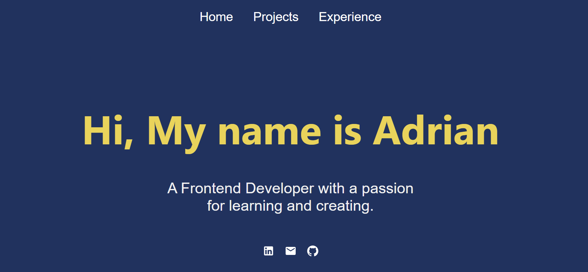

# Personal Portfolio

Welcome to my personal portfolio! This project is designed to showcase my skills and work in web development. Using the latest technologies and best practices, I have created a modern and interactive portfolio that highlights my experience and achievements.

## 🎨 Live Demo

You can view my portfolio live here to see the project in action: [Live Demo](https://adrian-portofolio.vercel.app/)

## 🛠 Technologies Used

This portfolio was built using the following technologies:

- **React**: JavaScript framework for building user interfaces.
- **React Router**: Library for navigating between pages.
- **CSS/SCSS**: Styling components and creating a modern, responsive design.
- **Webpack**: Bundling resources and managing dependencies.
- **Babel**: Compiling JavaScript ES6+ into code compatible with current browsers.
- **Node.js**: JavaScript runtime environment for the server-side.
- **npm**: Package manager for JavaScript.
